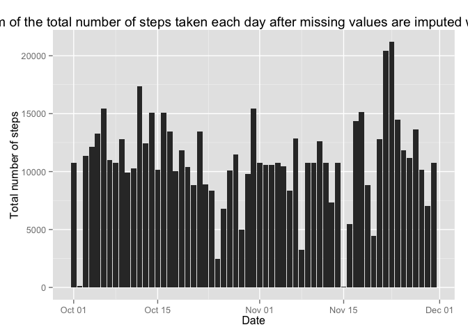

# Reproducible Research: Peer Assessment 1
ryanivanka  

## Code for reading in the dataset and/or processing the data


```r
#required libraries
unzip("activity.zip")
originalActivity <- read.csv("activity.csv")
originalActivity$date <- as.Date(originalActivity$date,'%Y-%m-%d')
activity <- na.omit(originalActivity)
head(activity)
```

```
##     steps       date interval
## 289     0 2012-10-02        0
## 290     0 2012-10-02        5
## 291     0 2012-10-02       10
## 292     0 2012-10-02       15
## 293     0 2012-10-02       20
## 294     0 2012-10-02       25
```

## Histogram of the total number of steps taken each day


```r
library(ggplot2)
stepsByDate <- aggregate(steps~date, data=activity, sum)
head(stepsByDate)
```

```
##         date steps
## 1 2012-10-02   126
## 2 2012-10-03 11352
## 3 2012-10-04 12116
## 4 2012-10-05 13294
## 5 2012-10-06 15420
## 6 2012-10-07 11015
```

```r
ggplot(stepsByDate, aes(x = date, y = steps)) + geom_histogram(stat = "identity") +
  labs(title="Histogram of the total number of steps taken each day", x="Date", y="Total number of steps")
```

 

## Mean and median number of steps taken each day


```r
mean(stepsByDate$steps)
```

```
## [1] 10766.19
```

```r
median(stepsByDate$steps)
```

```
## [1] 10765
```

## Time series plot of the average number of steps taken

```r
averageStepsPerDay <- aggregate(activity$steps, list(interval=as.numeric(as.character(activity$interval))), mean)
head(averageStepsPerDay)
```

```
##   interval         x
## 1        0 1.7169811
## 2        5 0.3396226
## 3       10 0.1320755
## 4       15 0.1509434
## 5       20 0.0754717
## 6       25 2.0943396
```

```r
ggplot(averageStepsPerDay, aes(x=interval, y=x)) + geom_line() +
    labs(title="Time series plot of the average number of steps taken", 
         x="5-minute interval", y="Average number of steps taken")
```

 

## The 5-minute interval that, on average, contains the maximum number of steps

```r
averageStepsPerDay[which.max(averageStepsPerDay$x), ]
```

```
##     interval        x
## 104      835 206.1698
```

## Code to describe and show a strategy for imputing missing data

```r
sum(is.na(originalActivity))
```

```
## [1] 2304
```

## Histogram of the total number of steps taken each day after missing values are imputed with Mean value

```r
full <- merge(originalActivity, averageStepsPerDay, by="interval")
head(full)
```

```
##   interval steps       date        x
## 1        0    NA 2012-10-01 1.716981
## 2        0     0 2012-11-23 1.716981
## 3        0     0 2012-10-28 1.716981
## 4        0     0 2012-11-06 1.716981
## 5        0     0 2012-11-24 1.716981
## 6        0     0 2012-11-15 1.716981
```

```r
imputed <- transform(full, steps=ifelse(is.na(steps), x, steps))
head(imputed)
```

```
##   interval    steps       date        x
## 1        0 1.716981 2012-10-01 1.716981
## 2        0 0.000000 2012-11-23 1.716981
## 3        0 0.000000 2012-10-28 1.716981
## 4        0 0.000000 2012-11-06 1.716981
## 5        0 0.000000 2012-11-24 1.716981
## 6        0 0.000000 2012-11-15 1.716981
```

```r
imputedStepsByDate <- aggregate(steps~date, data=imputed, sum)
ggplot(imputedStepsByDate, aes(x = date, y = steps)) + geom_histogram(stat = "identity") +
  labs(title="Histogram of the total number of steps taken each day after missing values are imputed with Mean value", x="Date", y="Total number of steps")
```

 

## Panel plot comparing the average number of steps taken per 5-minute interval across weekdays and weekends


```r
weekinfoDate <- transform(activity,weekday = ifelse(weekdays(as.Date(date))=="Sunday"|weekdays(as.Date(date))=="Saturday","Weekend","Weekday"))
head(weekinfoDate)
```

```
##     steps       date interval weekday
## 289     0 2012-10-02        0 Weekday
## 290     0 2012-10-02        5 Weekday
## 291     0 2012-10-02       10 Weekday
## 292     0 2012-10-02       15 Weekday
## 293     0 2012-10-02       20 Weekday
## 294     0 2012-10-02       25 Weekday
```

```r
interval4Weekday <- aggregate(weekinfoDate$steps, list(interval=weekinfoDate$interval, day=weekinfoDate$weekday), mean)
head(interval4Weekday)
```

```
##   interval     day         x
## 1        0 Weekday 2.3333333
## 2        5 Weekday 0.4615385
## 3       10 Weekday 0.1794872
## 4       15 Weekday 0.2051282
## 5       20 Weekday 0.1025641
## 6       25 Weekday 1.5128205
```

```r
par(mfrow=c(2,1))
weekday = interval4Weekday[interval4Weekday$day=="Weekday",]
weekwend = interval4Weekday[interval4Weekday$day=="Weekend",]
plot(weekday$interval, weekday$x,  type="l", pch="", ylab="Mean Steps Taken", xlab = "Five Minute Interval")
title(main="Weekday", col.main="blue", font.main=2)
plot(weekwend$interval, weekwend$x,  type="l", pch="", ylab="Mean Steps Taken", xlab = "Five Minute Interval")
title(main="Weekend", col.main="blue", font.main=2)
```

 

